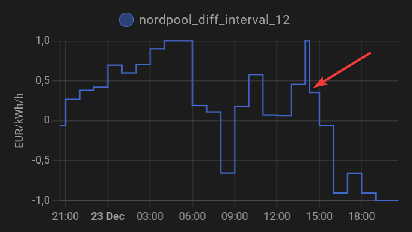

> [!WARNING]  
> 15-minute MTU is a PITA. Support for that is being drafted in [v0.3.x release](https://github.com/jpulakka/nordpool_diff/releases/),
> but everything doesn't work perfectly yet. Please follow https://github.com/jpulakka/nordpool_diff/issues/33 to keep updated.

# What is Nordpool diff?

Nordpool Diff enables you to make smarter use of hourly electricity prices by considering how the price will change over the coming hours. For example; the hours before a price increase it might be smart to run the water heater or turn up the thermostat, and during the expensive hours turn the thermostat down, thereby shifting your electricity consumption from expensive hours to cheaper hours.

As the share of renewables in our electricity grids increases, the price variations during each 24 hours will be greater and greater, and also negative prices. This means that not only will you save some money by using electricity smarter, but you will also help the electricity grid. High energy prices most often mean a higher degree of dirty energy sources, so by using electricity smarter, you also reduce your carbon footprint.

What Nordpool Diff does is add a sensor to Home Assistant that will tell you how the current price relates to the prices in the coming hours. Based on that, you can make automations in Home Assistant that take the upcoming electricity prices into account.

# What is Nordpool Diff suitable for?
Nordpool Diff is intended to optimise heating. Heating can be divided in two types:
1. Thermostats and other continuously adjustable appliances
2. Water heaters and other on/off appliances.

Nordpool Diff is not suitable for controlling washing machines, dishwashers and other things that needs to run for a number of hours in a stretch to work. Neither is it suitable for things that require to be on a minimum number of hours per day, as you won't know how for sure many hours per day a Nordpool Diff sensor will stay over some specific threshold. If you are looking for smart charging of your EV, use something like [EV Smart Charging](https://github.com/jonasbkarlsson/ev_smart_charging).

# Installation

1. Integrate electricity prices into Home Assistant, if you haven't already. You have two choices:
 	1. [Nordpool integration](https://www.home-assistant.io/integrations/nordpool/) This is the only built-in integration in Home Assistant that can import electricity prices.
 	2. [Entso-e](https://github.com/JaccoR/hass-entso-e). It has the benefit of being fully in accordance with the Terms and conditions. It also covers a few more markets than Nordpool.
2. Install `nordpool_diff`, either using HACS or manually
 	1. HACS (recommended)
     		1. Go to [HACS](https://hacs.xyz) in your Home Assistant instance and open `Custom Repositories`
     		2. Add this repository `https://github.com/jpulakka/nordpool_diff` as an `Integration`
     		3. Restart Home Assistant
  	1. Manually
     		1. Copy the `nordpool_diff` folder to HA `<config_dir>/custom_components/nordpool_diff/`
     		2. Restart HA. (Skipping restarting before modifying configuration would give "Integration 'nordpool_diff' not found" error message from the configuration.)
3. Create a first `nordpool_diff` sensor. Add the following to your `configuration.yaml` file:
  	```yaml
  	sensor:
        - platform: nordpool_diff
      	nordpool_entity: [your nordpool price sensor, for example sensor.nordpool_kwh_fi_eur_3_095_024]
      	filter_length: 10
      	normalize: max_min_sqrt_max
  	```
4. Restart Home Assistant again
5. You should now find a new  `sensor.nordpool_diff_triangle_10_normalize_max_min_sqrt_max` sensor that varies with the electricity price.

# Configuring Nordpool Diff

The following parameters can be added to the sensor:

| Name | Possible values | Default | Description |
| ---- | :-----: | :---: | ----------- |
|`nordpool_entity`|  |  | Your Nordpool sensor, for example `sensor.nordpool_kwh_fi_eur_3_095_024`. Mandatory if you use Nordpool. |
|`entsoe_entity`|  | `sensor.average_electricity_price_today` | Your Entso-E sensor, if you've named it during installation|
|`filter_type`| `triangle`, `rectangle`, `rank`, `interval` | `triangle`| See next chapters|
|`filter_length`| 2...20 | `10`| Defines how many hours into the future to consider|
|`normalize`| `no`, `max`, `max_min`, `sqrt_max`, `max_min_sqrt_max`| `no`| How to normalize the output of  `triangle` and `rectangle` filters. See [`Normalization` option](#normalization).|
|`unit`| | `EUR/kWh/h`|  The unit of the sensor. Loosely speaking reflects rate of change (1/h) of hourly price (EUR/kWh)|

You can create multiple Nordpool_diff sensors, with different parameters. This can be a good practice when you get familiar each with different parameter, plot them in the dashboard, and pick what you like best.

Note that you need to restart Home Assistant for each new sensor you add to `configuration.yaml`, reloading YAML isn't enough.

# How does Nordpool Diff work? (`filter_type: rectangle` and `filter_type: triangle`)
The basics is that the price of the current hour is compared to the upcoming hours. The number of hours is defined by `filter_length`. The output from the Nordpool diff sensor is a scoring in relation to the upcoming hours. The scoring can be done in different ways, and this is where `filter_type` comes into play. The most basic variant is that each of the upcoming hours is given equal weight. For example;

If you have the following Nordpool Diff sensor:
 ```yaml
 sensor:
    - platform: nordpool_diff
        filter_type: rectangle
        filter_length: 5
 ```
This means that the output of the sensor will be calculated as:

| Hour   | Price | Multiplier |  Sum per hour |
|:-------|:-----:|:-------------:|:------------:|
| 11-12  | 0.1   | -1        	| -0.1     	|
| 12-13  | 0.2   | 1/4       	| 0.05     	|
| 13-14  | 0.1   | 1/4       	| 0.025    	|
| 14-15  | 0.4   | 1/4       	| 0.1      	|
| 15-16  | 0.4   | 1/4       	| 0.1      	|
| Sum (value of sensor) | | | **0.175** |

So the scoring in this case is 0.175 EUR/kWh/h.

This number can be thought of as an indication of how much the price is changing per hour during the number of hours (given by the filter length). Mathematically, this is called a FIR-filter. This FIR-filter always has -1 as the first value, and then followed by the multipliers that depend on the filter length, as follows:

| `filter_length` | FIR-filter |
|:-------|:-----:|
| 2 | `[-1, 1]` |
| 3 | `[-1, 1/2, 1/2]` |
| 4 | `[-1, 1/3, 1/3, 1/3]` |
| 5 | `[-1, 1/4, 1/4, 1/4, 1/4]` |

...and so on...

As you see, the (rectangle) filter will weight all hours equally. It will basically tell: how does the current electricity price compare to the average of the hours within the filter length?

##  `filter_type: triangle`
In addition to `rectangle`, Nordpool Diff also supports `triangle` as filter type. While the `rectangle` filter puts equal weight on all future electricity price, `triangle` put greater weight on the hours closeser in time. This can be illustrated as:

| `filter_length` | FIR-filter |
|:-------|:-----:|
| 2 | `[-1, 1]` |
| 3 | `[-1, 2/3, 1/3]` |
| 4 | `[-1, 3/6, 2/6, 1/6]` |
| 5 | `[-1, 4/10, 3/10, 2/10, 1/10]` |

...and so on...

Looking at the numbers in the FIR-filter, you might be able to spot why it's called `triangle`.

This filter type can be used to more aggressively turn up a thermostat in preparation of a price hike.

The difference between rectangle and triangle can be better understood with a visual example. Consider these two sensors:

 ```yaml
 sensor:
   - platform: nordpool_diff
     filter_type: rectangle
     filter_length: 2
   - platform: nordpool_diff
     filter_type: triangle
     filter_length: 10
 ```
They yield the following graph:


## Normalize
Sensors with `filter_type: rectangle` or `filter_type: triangle` have an output that is proportional to the variations in of the electricity price. The greater variation, the greater the output. If a thermostat is intended to vary +/-2 degrees under normal price variations, it may start varying much more if the price variations are larger than normal. It doesn't make sense for a thermostat to be adjusted with +/-20 deg C, no matter how the electricity prices varies.

`normalize` addresses this problem. Options include:
* `normalize: max_min_sqrt_max`: **Recommended**. Output of the filter is multiplied by square root of maximum price of the next `filter_length` hours and divided by maximum minus minimum price of the next `filter_length` hours. Think about it this way:
  * Raw output of the FIR differentiator is proportional to price *variation*.
  * Divide by maximum minus minimum price (= price variation; could also use e.g. standard deviation), to get scale-free output.
  * Multiply by square root of maximum price (could also use e.g. average, but max is good enough and besides less likely negative), to introduce scale. So now 9x price gives 3x output.
* `normalize: max`: Output of the filter is divided by maximum price of the next `filter_length` hours.
* `normalize: max_min`: Output of the filter is divided by maximum minus minimum price of the next `filter_length` hours.
* `normalize: sqrt_max`: Output of the filter is divided by square root of maximum price of the next `filter_length` hours. This provides "somewhat scale-free normalization" where the output magnitude depends on price magnitude, but not linearly so.
* `normalize: no`: No normalization. Not recommended if you are controlling a thermostat.

Possible edge cases of price staying exactly constant, zero or negative for long time are handled gracefully.

In addition to this, you should use a filter length of 10 or more for `normalize` to work well.

The `normalize` parameter has no effect on `rank` or `interval`.


# Optimizing water heaters (`filter_type` `rank` and `interval`)

With `filter_type: rank`, the current price is ranked amongst the next `filter_length` prices. The lowest price is given a value of `1`, the highest price is given the value of `-1`, and the other prices are equally distributed in this interval.

With `filter_type: interval`, the current price is placed inside the interval of the next `filter_length` prices. The lowest price is given a value of `1`, the highest price is given the value of `-1`, and the current price is linearly placed inside this interval.

If the current price is the lowest or highest price for the next `filter_length` prices, both filter types will output `1` or `-1`, respectively.  If the next three prices are `1.4`, `1` and `2`, the `rank` filter will output `0` and the `interval` filter will output `0.2`.

Since the output magnitude of the `rank` and `interval` filters are always between -1 and +1, independent of magnitude of price variation, it may be more appropriate (than the linear FIR filters) for simple thresholding and controlling binary things can only be turned on/off, such as water heaters.

Example:

 ```yaml
 sensor:
  - platform: nordpool_diff
	nordpool_entity: sensor.nordpool_kwh_fi_eur_5_10_0
	filter_type: interval
	filter_length: 12
```

# Various comments

## Avoiding short cycles
If you have an appliance such as a heat pump, for which you would like to avoid short "on" cycles, you might get such a short cycle if you're at the end of an hour (for example 11:59) and your automation will turn the appliance off when the next hour starts due to the new value of the Nordpool Diff sensor, causing the appliance to only run for 1 minute.
If you have such an automation, you can benefit from the sensor attribute `next_hour` that indicates what the value of the sensor will be next hour.

## ENTSO-E vs. Nord Pool

This component was initially (in 2021) created to support https://github.com/custom-components/nordpool, hence the name. But after that (in 2022) https://github.com/JaccoR/hass-entso-e became available. Besides being 100 % legal to use, ENTSO-E also covers a wider range of markets than Nord Pool.
[Nord Pool API documentation](https://www.nordpoolgroup.com/en/trading/api/) states:
_If you are a Nord Pool customer, using our trading APIs is free. All others must become a customer to use our APIs._
Which apparently means that almost nobody should be using it, even though the API is technically public and appears to work without any tokens.
It's more correct to use [ENTSO-E](https://transparency.entsoe.eu/) which is intended to be used by anyone.

Nordpool Diff supports both Entso-E and Nordpool, and if you have _both_ integrated, Nordpool Diff will use both for redundancy as follows:

1. In first hand, use prices from Entso-E.
2. If less than N upcoming hours are available, then look up prices from Nordpool too.
3. Use whichever (Entso-E or Nordpool) provided more upcoming hours.

## Known limitations

### If price sensor is not found, no error will be provided
If you forget to point out the price sensor in `configuration.yaml`, you will just get a Nordpool Diff sensor value of 0 but no error.

### Adding new sensors requires a restart
If you add a new Nordpool Diff sensor, Home Assistant must be restarted. Reloading the YAML configuration is not sufficient.

### Changes to sensor value in the middle of the hour
As you know, a new set of prices for the next day is published about 10-11 hours before they start to come into effect. If you have a filter length of 11 or larger, you might notice that the filter for the current hour changes in the middle of an hour during the afternoon.


This is since the filter suddenly has new hours to take into account, meaning it immediately makes use of new information and hence technically not an error. It might however become a problem if you are looking to avoid short on-cycles or similar.

## Debug logging
Add the following to `configuration.yaml`:

 ```yaml
logger:
  default: info
  logs:
	custom_components.nordpool_diff.sensor: debug
```
