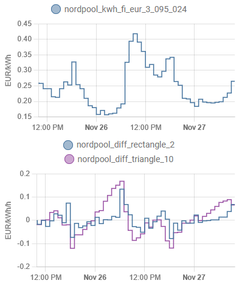

# nordpool_diff custom component for Home Assistant

Requires https://github.com/JaccoR/hass-entso-e and/or https://github.com/custom-components/nordpool

[ENTSO-E](https://transparency.entsoe.eu/) or [Nord Pool](https://www.nordpoolgroup.com/) give you spot prices,
but making good use of those prices is not easy.
This component provides various algorithms whose output can be used for deciding when to turn water heater or
car charger on/off, or for adjusting target temperature of a heater so that it will heat more just before prices
will go up (to allow heating less when prices are high), and heat less just before prices will go down.

Apart from potentially saving some money, this kind of temporal shifting of consumption can also save the environment,
because expensive peaks are produced by dirtier energy sources. Also helps solving Europe's electricity crisis.

The output is most suitable for fine-tuning continuously adjustable things (thermostats), or it can be thresholded
to control binary things that can be switched on/off anytime, such as water heaters. So far it is not directly
suitable for controlling things that require N contiguous hours to work, such as washing machines. Also, there are
no guarantees about how many hours per day the output will stay above some threshold, even if typical price variations
may make the output typically behave this or that way most of the time.

## ENTSO-E vs. Nord Pool

This component was initially (in 2021) created to support https://github.com/custom-components/nordpool, hence the name.
But after that (in 2022) https://github.com/JaccoR/hass-entso-e became available. Besides being 100 % legal to use[^1],
ENTSO-E also covers wider range of markets than Nord Pool.

Since v0.2.0 / https://github.com/jpulakka/nordpool_diff/issues/21 hass-entso-e is preferred and default, but nordpool
still works, and can also be used together with hass-entso-e as an automatic fallback mechanism when ENTSO-E API is down.

## Installation

Install and configure https://github.com/JaccoR/hass-entso-e/ and/or https://github.com/custom-components/nordpool first.

### Option 1: HACS
1. Go to HACS -> Integrations
2. Click the three dots on the top right and select `Custom Repositories`
3. Enter `https://github.com/jpulakka/nordpool_diff` as repository, select the category `Integration` and click Add
4. A new custom integration shows up for installation (Nordpool Diff) - install it
5. Restart Home Assistant

### Option 2: Manual
1. Copy the `nordpool_diff` folder to HA `<config_dir>/custom_components/nordpool_diff/`
2. Restart HA. (Skipping restarting before modifying configuration would give "Integration 'nordpool_diff' not found"
   error message from the configuration.)
   
## Configuration

1. Add the following to your `configuration.yaml` file:

    ```yaml
    sensor:
      - platform: nordpool_diff
    ```

    The default setup assumes that hass-entso-e provides `sensor.current_electricity_market_price` entity.
    Explicit `entsoe_entity` and/or `nordpool_entity` IDs can also be specified:

    ```yaml
    sensor:
      - platform: nordpool_diff
        entsoe_entity: sensor.current_electricity_market_price
        nordpool_entity: sensor.nordpool_kwh_fi_eur_3_095_024
    ```

   Modify the `entsoe_entity` and/or `nordpool_entity` values according to your exact entity IDs.

2. Restart HA again to load the configuration. Now you should see `nordpool_diff_triangle_10` sensor, where
   the `triangle_10` part corresponds to default values of optional parameters, explained below.

## Optional parameters

Other parameters to configure include `filter_length`, `filter_type`, `unit` and `normalize`, defaults are `10`, `triangle`,
`EUR/kWh/h` and `no`, respectively:

  ```yaml
  sensor:
  - platform: nordpool_diff
    filter_length: 10
    filter_type: triangle
    unit: EUR/kWh/h
    normalize: no
  ```

`unit` can be any string. The default is EUR/kWh/h to reflect that the sensor output loosely speaking reflects change
rate (1/h) of hourly price (EUR/kWh).

`filter_length` value must be an integer between 2...20, and `filter_type` must be either `triangle`, `rectangle`,
`rank` or `interval`. They are best explained by examples. You can set up several `nordpool_diff` entities,
each with different parameters, plot them in Lovelace, and pick what you like best. Here is an example:



## Triangle and rectangle

`filter_type: triangle` and `filter_type: rectangle` are linear filters. They apply non-causal FIR differentiator[^2] to spot prices,
resulting in a predictive sensor that gives positive output when the price of electricity for the current hour is cheaper
compared to the next few hours (and negative output in the opposite case).

For illustrative purposes, the following FIRs have been reflected about the time axis; the first multiplier corresponds to
current hour and the next multipliers correspond to upcoming hours.

Smallest possible `filter_length: 2` creates FIR `[-1, 1]`. That is, price for the current hour is subtracted from the
price of the next hour. In this case `filter_type: rectangle` and `filter_type: triangle` are identical.

`filter_length: 3`,
* `filter_type: rectangle` creates FIR `[-1, 1/2, 1/2]`
* `filter_type: triangle` creates FIR `[-1, 2/3, 1/3]`

`filter_length: 4`,
* `filter_type: rectangle` creates FIR `[-1, 1/3, 1/3, 1/3]`
* `filter_type: triangle` creates FIR `[-1, 3/6, 2/6, 1/6]`

`filter_length: 5`,
* `filter_type: rectangle` creates FIR `[-1, 1/4, 1/4, 1/4, 1/4]`
* `filter_type: triangle` creates FIR `[-1, 4/10, 3/10, 2/10, 1/10]`

And so on. With rectangle, the right side of the filter is "flat". With triangle, the right side is weighting soon
upcoming hours more than the farther away "tail" hours. First entry is always -1 and the filter is normalized so that
its sum is zero. This way the characteristic output magnitude is independent of the settings.

### Normalize

With linear filters `filter_type: triangle` and `filter_type: rectangle`, magnitude of output is proportional to
magnitude of input = price (variations) of electricity. Between 2021-2022, that has increased tenfold, so the characteristic
output magnitude of the filter has also increased tenfold. That causes problems in proportional controllers; if a heater target
used to be adjusted roughly +-2 deg C, it's not reasonable for that to become +-20 deg C, no matter how the electricity prices evolve.

To compensate for that, `normalize` was introduced. Current options include `normalize: no` (no normalization, default),
`normalize: max` (output of the filter is divided by maximum price of the next `filter_length` hours), and `normalize: max_min`
(output of the filter is divided by maximum minus minimum price of the next `filter_length` hours). These work reasonably
when `filter_length` is 10 or more, making the output magnitude less dependent of current overall electricity price.

## Rank and interval

With `filter_type: rank`, the current price is ranked amongst the next `filter_length` prices. The lowest price is given
a value of `1`, the highest price is given the value of `-1`, and the other prices are equally distributed in this
interval.

With `filter_type: interval`, the current price is placed inside the interval of the next `filter_length` prices. The
lowest price is given a value of `1`, the highest price is given the value of `-1`, and the current price is linearly
placed inside this interval.

If the current price is the lowest or highest price for the next `filter_length` prices, both filter types will output
`1` or `-1`, respectively.  If the next three prices are `1.4`, `1` and `2`, the `rank` filter will output `0` and the
`interval` filter will output `0.2`.

Since the output magnitude of the `rank` and `interval` filters are always between -1 and +1, independent of magnitude
of price variation, it may be more appropriate (than the linear FIR filters) for simple thresholding and controlling
binary things can only be turned on/off, such as water heaters. `normalize` setting has no effect on `rank` nor `interval`.

## Attributes

Apart from the principal value, the sensor provides an attribute `next_hour`, which can be useful when we're close to
hour boundary and making decisions about turning something on or off; if it's xx:59 and the principal value is above some
threshold but the next hour value is below the threshold, and we would like to avoid short "on" cycles, then we maybe
shouldn't turn the thing on at xx:59 if we would turn it off only after 1 minute. This can be avoided by taking the next
hour value into account.

## Debug logging

Add the following to `configuration.yaml`:

 ```yaml
logger:
  default: info
  logs:
    custom_components.nordpool_diff.sensor: debug
```

[^1]: [Nord Pool API documentation](https://www.nordpoolgroup.com/en/trading/api/) states
_If you are a Nord Pool customer, using our trading APIs is for free. All others must become a customer to use our APIs._
Which apparently means that almost nobody should be using it, even though the API is technically public and appears to work without any tokens.

[^2]: Fancy way of saying that the price for the current hour is subtracted from the average price for the next few
hours.
